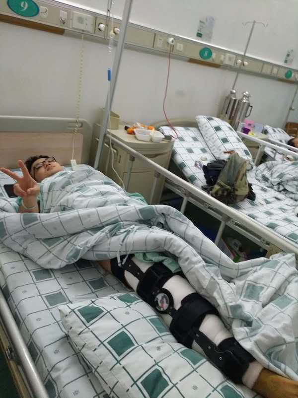
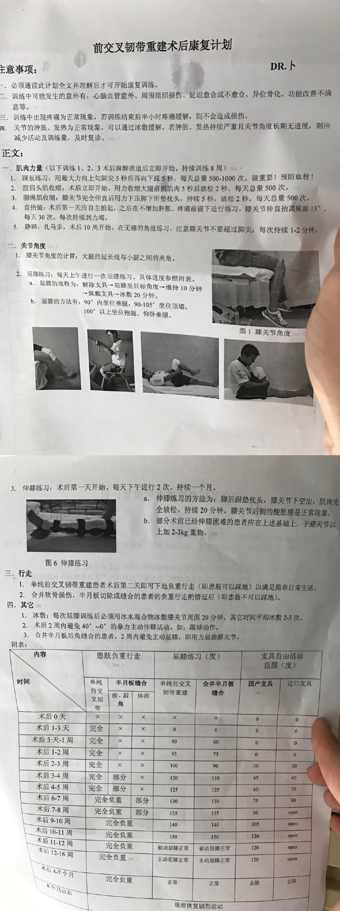
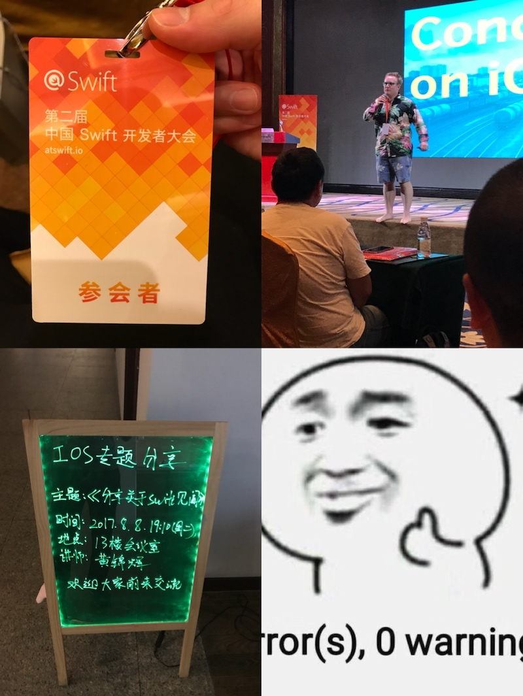

又到了一年的年末，过去就一直想写篇总结来回顾自己一年以来的成长，但是苦于没有一个像样的博客，也有可能只是纯粹的懒，所以一直都没有写。今年，自己的博客也上线了，怎么也是时候写了吧。2017发生了很多事情，我也从中学到了很多，并且在以社会人这个身份度过了一年以后，我开始更加地了解自己。  

这是我的第一篇年终总结，没有经验，也不知从何说起，那我就脑子里冒出什么，写什么吧。

# 意外的经历——前叉韧带修复术
## 一场噩梦
先来说说年初发生的一件让我痛彻心扉，刻骨铭心的事吧！那就是我做了前叉韧带修复手术+半月板缝合术，原因是因为16年初的一场篮球赛。而术后的那天，我长这样：  
  
那晚是一个不眠之夜，虽然医生提前给我打了预防针说那晚我会非常疼，但是这场灾难依然是如此的猝不及防。我还记得那天晚上我熬了整个通宵，膝盖的手术导致整条右腿不能移动，而持续的超乎想象的疼痛从膝盖处传来，尽管我没有任何悲伤的情绪，可我的眼泪还是止不住的掉——此时我已经打了两管止痛针了。到了深夜，病房关上灯，大家都睡了——包括前来照看我的妈妈，只剩我一个人在煎熬，我很疼，我咬着牙齿，我啜泣着，我想喊救命（好像我也确实喊了，但是没有惊醒任何人），我不断地看手机，我需要知道这个晚上还有多久，所以1点、2点、3点、4点，我看着时间缓缓地流逝，终于，我等来了黎明。到了凌晨6点左右，终于不再那么疼了，我也顺势就睡着了。  
## 噩梦过后
先贴上康复训练的内容：  

  
图片过长，已自动收起，有兴趣可以点开看

  

这次手术最恐怖的地方已经过去了，后面日子也渐渐地好起来，不断按照医生的建议去做康复训练就行了。总的来说，康复训练的内容我都良好地完成了，我的膝盖康复得还算不错，其中还多次被治疗我的医生夸赞了，说我康复训练做得非常到位，恢复效果很好。  

但是我知道，这都不是我一个人的功劳。我得感谢在医院里悉心照料和督促我每天去做康复训练的妈妈，还有出院后照顾我和帮助我做康复训练的妹子=。=~其次还得感谢一个人，就是[阳锅](http://blog.gocy.tech)，在医院百无聊赖的时间里，给我送来了需要自己拼的海贼王万里阳光号的模型。  

# 日常的修行——在工作中打磨技术
虽然去年我没有写年终总结，但是我还是暗暗地给自己定下了今年的目标。主要就是学好`swift`和`js`，而为了避免让这个**“学好”**太过模糊，我又加了一些比较细节的定制。
* swift: 看完《swift进阶》，学会`swift`的语法，理解`swift`对比`oc`的优劣，明白怎么从真正意义上的用`swift`的方式来构建项目。
* js: 学会`js`在前端方面的基本应用，学会`js`的语法，了解`js`的设计思想，还有弄懂`js`的语言特性。

_那么这个目标，我完成得怎么样呢？_  

`swift`的进步不尽人意，而`js`的进步超乎我的意料。  

这本由[objc.io](https://www.objc.io)出版，[喵神](https://onevcat.com)翻译的[《Swift进阶》](https://objccn.io/products/advanced-swift/)我拜读了约莫三分之二，读的时候真的觉得大有裨益，但是由于工作中不会使用swift，而且日常里也几乎没有地方可以接触到swift（除了自己的项目），读了后面忘了前面，感觉非常挫败加上正值工作非常忙碌的时候，所以便放弃了。后面跟着喵神的视频用swift写过命令行程序[Fiber](https://github.com/dark19940411/Fiber)——目标是兼容`HTTP`、`FTP`和`BT`三种下载方式的下载器和[SwiftTorrentParser](https://github.com/dark19940411/SwiftTorrentParser)——可以说是[Fiber](https://github.com/dark19940411/Fiber)的衍生产物，用swift写的一个BT种子解析器。不过由于它们的难度远大于我的想象，所以今年并没有完成。  

但是我回望一下自己学好`swift`的目标细节，可以知道的是，我已经学会了`swift`的语法，并且理解了`swift`对比`oc`的优劣，也懂得了怎么用`swift`的方式来构建iOS项目了。额外的一点惊喜是，今年年中在公司的赞助之下我参加了今年的[@swift大会](https://www.bagevent.com/event/378252)，和来自五湖四海的iOS开发者有了许多有趣的交流。并且当时在[唐巧](http://blog.devtang.com)的演讲主题的驱使之下，我基于**swift为什么这么快？**这个主题做了深入的研究，并且在公司还做了一场演讲呢。  

而在`js`方面，一个是前端方面用来写过一些简单的运营页面，还有稍微复杂一点的模板，后面就是自己看《JavaScript编程详解》学习的知识。其次就是利用`node.js`完成了[Turto](https://github.com/dark19940411/TurtleHomePage)(我的网站的生成器，目前还整个都嵌在我的网站的仓库里)，也成功的完成了自己的博客的构建。  

谈了自己个人的学习，也得谈谈我的工作吧。

> 今年工作上的收获挺多的。  

回顾一下，今年所有的需求我都良好的完成了，并且不留bug，也从未拖过发版本的进度，也没有挖过大坑，所以我觉得自己今年在工作上的表现还不错。  

WPS确实是一个非常庞大的项目，很容易牵一发而动全身，所以了解项目的相关功能尤为重要——而有时我选择看源码，更多的时候我选择和功能的原作者进行沟通。而在这样子的工作模式下，我发现以前害怕去看的源码，我不再害怕了，甚至曾经看不懂的代码，我可以看懂了，并且熟悉代码的速度与日俱增；其次，当沟通可以作为一条你熟悉老流程的捷径的时候，一定要善用，这个方式将远优于于你埋头苦干。  

然后我细想一下今年做过的需求里，难的那部分有一些都是突破了自己以往认知，并且是自己从未接触过的新知识；而另一些则是改动点影响面非常广，代码写起来需要慎之又慎。在WPS里，做过比如[File Provider Extension](https://developer.apple.com/documentation/fileprovider)（也就是Files里的云盘）以及其它的一些纯逻辑的需求，这些功能都让我对iOS程序的算法依赖有了很大的改观。  

在这一年的历练之下，我进一步地理解了Xcode里workspace和project之间的关系，也更加理解project底下的targets们之间的依赖关系。越来越苛求自己去写出最优化的（我能想到的）代码，尽管我现在写着当年自己觉得**算法不是那么重要**的iOS程序，我也会经常考虑它的时间和空间复杂度。我也越来越重视代码里的架构，而在自己的不断尝试之下，我对iOS的架构也有了更好的理解，写代码的时候也偏好组件化，抽象的层级也定义得比以往更有经验，曾经还比较陌生的理论型iOS架构——`MVVM`和`Viper`等也手到擒来。  

在金山的这一年，我并没有加很多的班，一年里加起来大概只有2个多月的时间试过996。所以我有相对多的空档可以做自己的事，所以我的技术进步里，有相当的一部分来源于我自己**“没事找事”**建立的项目，从中也学到了不少的东西。可也正是这一点会让我比较迷茫，毕竟这都只是我自己构思出来的项目，虽然我努力了，学到了，但是我依旧不清楚它们能给我带来多少的竞争力。从和周边的同学的加班程度的对比来说，我觉得我司应该属于加班相对少的类型。所以我不知道我自己额外增加的学习目标，是否就能和那些在工作上付出了更加多时间的人们去竞争。  

这是我感到迷茫的地方，因为我怕我失去竞争力，也怕自己的努力方向不对，但是除了每年好好的工作，制定自己的学习计划并完成以外，我也不能怎么样。  

但是尽管如此，我也并不喜欢加班，哈哈！如果要从**一年换三年工作经验**式的加班和现在的这种**工作量适中，偶尔可以做做自己的个人项目**的生活中选一种，我一定还是选择后者。  

# 健康与生活
熟悉我的人都知道我是个健身爱好者，今年的前半年惨遭断腿，1月初到5月底都没有进出过健身房，我的体重也一路从140斤飙升到148斤（我已经尽量控制了，还是没办法），体脂也目测升到了18-20左右。  
后半年恢复健身，从6月初到12月初，我一直保持着每周三练的水平，虽然体重没有降低，但是体脂已经降了很多，一度消失胸肌和背肌（尤其是背）也再度回归。后面膝盖的恢复情况越来越好，也慢慢将深蹲和硬拉加入到训练日当中。  

12月初到现在，由于公司要迁址，自己也搬家搬到郊区了，并且公司新园区听说会有健身房，所以健身房的卡也没有继续续费，这个月也就没有训练了。等到明年再开始吧！  

而日常的生活里就是和我怡腻歪=。=周末一起做饭，偶尔一起出去玩，出去跑步啥的，过得还算挺滋润的。总之，能遇到我妹子很幸运，没有她的话今年我不会过得这么精彩，这么开心。其次今年我生日的时候她给我送了一台ps4，也是打开了我在单机游戏界的大门，而这台机子也让我远离网游，爱上那该死的单机。（不说了，我得赶紧去玩我的血缘了。）  

快到文末了，还是得感谢一波[阳锅](http://blog.gocy.tech)，因为他是一个很优秀的人，而我总喜欢和他竞争，虽然我未必能赢，但是也正是这样的竞争关系督促了我写下这一篇年终总结。

# 未来的展望
关于2018，我给自己定下的目标就是，学会`OpenGL ES`或者`Metal`其中的一种——让我更加的了解图形学；其次就是iOS往更深层次去学习，手头正好有《深入解析MacOS & iOS操作系统》和《iOS逆向工程》两本书值得自己去深究，希望我能看完其中之一吧。  

