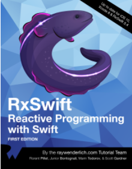
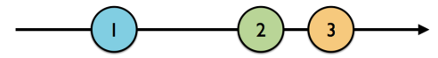

### 前言

最近在学习swift，看着喵神翻译的《Swift进阶》，一直看着颇感疲乏，于是想边学边实践来让自己不那么的犯困。毕竟纸上得来终觉浅嘛~所以我就顺手入了Raywenderlich上的RxSwift的书籍（这是一本好书，延续了Raywenderlich一贯的风格——讲课与动手相结合，每一章都有一个样例程序让你一步步跟着去实现，结尾还会有challenge）。并且，这也是我在简书的第一篇文章，主要是我的手提上的hexo挂了，挂在github上的博客也没法更新了，弄了两个星期都没弄好，没辙了。然而学习仍在继续，笔记也是要做的，所以就先来简书写写吧~

然后围绕着RxSwift这个主题，估计我会写上好几篇文章，基本上每个小的主题也都会跟着《RxSwift--Reactive Programming with Swift》这本书来，你也会看到很多这本书的影子。那么如果你没有这本书，通过我的文章来一窥RxSwift的究竟我想也是可以的，假如你有买这本书，在学习的路上有什么不懂的可以留言评论互相交流，如果你看到我的博客有什么不对的地方也希望指出改正！提前谢过！  


### RxSwift简介  
我对RxSwift的了解并不多，但就依我目前的了解，RxSwift主要是提供了一种在Swift语言下可以轻易写出响应式函数式的功能实现。主要就是方便了我们现在的多线程处理获取数据并进行处理的这么一个流程。说到后台获取数据，你的第一反应大概是`GCD`, `OperationQueue`, `Delegate`, `NotificationCenter`. 为此你不得不实现一些协议，写多几个方法，甚至要实现一些类。然而RxSwift和RxCocoa的出现让我们摆脱了这些。让你可以在无数的`.function()`调用函数中立即做出*对即将获取到的数据的处理*。而且它最基础的实现，源自于`Observable`，因为`Observable`就像一条数据流，当新的数据出现，它就会通知它的`Subscriber`去做对应的处理。总而言之，比起曾经你在`Cocoa Touch`上所用到的方式，使用RxSwift后，你会看到一片不一样的天地。  

### RxSwift安装指南
详见[官网](https://github.com/ReactiveX/RxSwift)  

### 什么是Observable？
`Observable`我也不知道中文怎么翻译，直译一下就是可观察的，但它通常都会被实例化，于是我称它为可观察的实例。  
实质上，它就是一个`Sequence`（序列），序列分为有穷序列和无穷序列，主要就是用来形成一条数据流。说到有穷的数据流，我们不难想到通过网络来获取一张图片这一个过程，数据是有限的，图片下载完了，序列也就迎来闭合了；而说到无穷序列，一般就是我们对UI的监测可能是无穷的，比如某个手势、某次按钮的点击、横竖屏切换等等。  

而你所有的操作产生的数据都会通过`Observable`传输——所以实质上`Observable`就是一条数据流。  

  

### Observable的三种事件  
`Observable`里有三种事件——`next`, `completed`, `error`：
* `next`事件主要是当`Observable`里出现新的数据时会发出的事件，同时该事件会携带新的数据对象。  
* `completed`事件是当`Observable`不再有新的数据出现，`Observable`被标记完成，并且将数据流终结(terminate)。
* `error`事件是指当数据流遇到了错误会发出的事件，该事件也会导致`Observable`被终结。
值得一提的是，被终结的`Observable`不会再有任何的事件发出。 

### Observable如何创建？
#### just, of, from
`Observable`类自带三个方法来创建一个`Observable`实例，分别使用于不同的情况。of方法毫无疑问是最常用也最方便的一个方法。但是现在还是把每一个都做一个简单的介绍吧！  
  
`just`方法所创建出的`Observable`实例可以说是和just的字面意义非常的相近了，因为`just`仅能传入一个参数作为`Observable`内所包含的元素来创建一个实例。考虑以下代码片段：
```swift
let one = 1
let two = 2

let variable = Observable.just(one)
```
这就是用`just`来创建一个`Observable`实例的方式。如果你也run了上面的代码，你可以用option+鼠标左键点击上面的变量`variable`，你可以发现编译器的类型推断为Observable<Int>。是的，`just`, `of`方法接受的参数都是泛型的。
  
`of`方法可以接受多个参数来创建实例。考虑以下代码片段：  
```swift
let one = 1
let two = 2
let three = 3

let variable = Observable.of(one, two , three)
let variable2 = Observable.of([one, two, three])
```
回顾一下我之前说的，`Observable`实质上就是一条数据流，所有的创建方法所传入的参数都是这条数据流上的元素。上面的那段代码，对于`variable`变量而言，`one`, `two`, `three`就是里面的元素，对于`variable2`而言，数组`[one, two, three]`就是里面的元素。option+click一下，`variable`被推断成为`Observable<Int>`，`variable2`被推断成为`Observable<[Int]>`。这里为什么要看似多此一举的声明一个`variable2`呢？因为这和接下来的`from`方法有关系，为了理清楚两个创建方法的不同，就在这里先声明一个这样的变量先。   
  
`from`方法只接收数组作为参数，并抽取出数组里的元素来作为数据流中的元素。代码如下：
```swift
let variable = Observable.from([1, 2, 3])
```
在这里，如果你用option+click去看`variable`的推断类型的话，你可以发现它的推断类型是`Observable<Int>`，和`of`不同的是，`of`创建的实例以数组作为元素；`from`则以`1`, `2`, `3`作为元素。  
  
#### range方法
利用`range`我们可以快速的创建一个包含一段范围内的正整数的数据流。它接受`start`和`count`作为参数来表示一段创建的范围。
```swift
let observable = Observable<Int>.range(start: 1, count: 10)
```
  
#### empty()——创建一个空的可观察的实例
为了让接下来的创建方法更加地容易理解，我不得不把稍后才会讲到订阅（subscribe）方法提前使用，但是我相信你能看懂，至于详尽的使用方式，就见下文吧！  
`empty()`方法主要是创建了一个空的数据流，里面没有任何的元素，所以它不会发出任何的`next`事件，它只会发出一个`completed`事件，然后终结。还有一点是，没有被订阅的`Observable`实例并不会发出任何事件，也不会终结，所以你看到上面所创建的数据流，其中的数据也并没有被处理。  
直到订阅者出现，数据流就会开始向订阅者发送事件了！  
```swift
let observable = Observable<Void>.empty()

observable
  .subscribe(
    onNext: {element in
      print(element)
    }, 
    onCompleted: {
      print("completed")
    })
/*
输出：
completed
*/
```
这段代码首先用`empty()`创建了一个不含元素的`Observable<Void>`实例，然后订阅了这个实例的`next`事件和`completed`事件，由于这条数据流不含任何元素，所以它直接向订阅者发送了一个`completed`事件然后就终结了。  

#### never()——创建一个代表无尽时长的数据流
`never()`方法创建了一个不会发出任何事件也不会终结的`Observable`实例，尽管如此，它也可以代表一段无限（相对无限）的时长。但是，如果它不能发出任何事件，那又有什么用呢？其实它可以配合`do`方法来做一些工作，它还可以被`subscribe`到`dispose`“事件”，来判断在当前的环境下，never()是什么时候被回收的。当然，`dispose`和`do`目前都没有介绍，详情见下文。  

### Subscribe
订阅一个`Observable`实例主要有两个方法，talk is cheap, show you the code.
```swift
let observable = Observable.of(1, 2, 3)

//1
observable.subscribe({ event in
  print(event)
})

//2
observable.subscribe(onNext: { element in
  print(element)
})

/*
输出结果：
next(1)
next(2)
next(3)
completed
1
2
3
*/
```
这段代码里用了两个方法来`subscribe`一个`Observable`对象，方法1直接`subscribe`了所有的事件，在回调的block里获取到的参数就是事件本身；而方法2则提供了几个可选的参数比如`onNext`, `onError`, `onCompleted`, `onDisposed`来订阅到不同的事件，而我提供的样例里订阅的是`next`事件。`next`事件的回调block会传入当前`next`事件所携带的元素。  
  
### dispose和DisposeBag——让订阅者释放  
如果你足够细心的话，你会发现每次`subscribe`方法调用后都会返回一个`Disposable`对象，代表着每一次订阅都是需要被释放的，遗憾的是，这并不由ARC进行管理，而是由RxSwift来管理。然而，RxSwift也没有提供自动释放的机制，始终是需要你手动释放的。  

一种方法是调用`Disposable`的`dispose()`方法。
```swift
let observable = Observable.of("A", "B", "C")

observable
    .subscribe(onNext: { element in
        print(element)
    }, onCompleted: { 
        print("completed")
    }, onDisposed: { 
        print("disposed")
    })
    .dispose()

/*
输出结果：
A
B
C
completed
disposed
*/
```
每次订阅都要单独管理它的释放是非常冗余的（书里原话，但实质上我也没感觉和加到垃圾袋里有多大差别，反正也是每次要多调用一个函数），所以RxSwift提供了一个类似于`Auto Release Pool`的释放机制，称为`DisposeBag`。被加到`DisposeBag`的`Disposable`对象会在`DisposeBag`将要释放的时候被逐一调用`dispose()`。它的使用是这样的：
```swift
let disposeBag = DisposeBag()
    
Observable.of("A", "B", "C")
    .subscribe { print($0) }
    .addDisposableTo(disposeBag)

/*
输出结果：
next(A)
next(B)
next(C)
completed
```
实际上，从上面两段的代码我们可以看出来，虽然`subscribe`可以订阅到一次订阅被释放时的`disposed`"事件"，是的，我这里打了双引号，因为它和`next`, `error`, `completed`不一样。从第二段代码来看就很明了了，并没有打印出`disposed`相关的事件。

### create——创建一条可自定义事件的数据流 
`create`嘛，功能就像标题说的那样，创建一个`Observable`对象，但是里面的事件可以有你来自定义。
```swift
enum MyError: Error {
    case anError
}

let disposeBag = DisposeBag()

Observable<String>.create { observer in
    observer.onNext("1")
    
    observer.onError(MyError.anError)
    
    observer.onCompleted()
    
    observer.onNext("?")
    
    return Disposables.create() //return a disposable to represent a subscription
}
.subscribe(
    onNext: { print($0) },
    onError: { print($0) },
    onCompleted: { print("completed") },
    onDisposed: { print("Disposed") }
)
.addDisposableTo(disposeBag)

/*
输出结果：
1
anError
Disposed
*/
```
正如代码所示，上面的`create`为一个`observer`添加了`next`, `error`, `completed`, `next`事件，但是很显然它输出到`error`事件就终结了，后面的事件也不会再发出。  
如果你想的话，你可以标注或者移位上面的代码，来看看不同的输出。  
  
### deferred——创建一个可以生成不同的Observable对象的工厂  
`deferred`就是一个`Observable`的工厂，你可以在里面定制几条不同的数据流，从而提供给外部不同的订阅，代码如下：  
```swift
let disposeBag = DisposeBag()

var flip = false

let factory: Observable<Int> = Observable.deferred {
    flip = !flip
    
    if flip {
        return Observable.of(1, 2, 3)
    }
    else {
        return Observable.of(4, 5, 6)
    }
}

for _ in 0...3 {
    factory.subscribe(onNext: { print($0, terminator:"") })
    .addDisposableTo(disposeBag)
    
    print()
}

/*
输出结果：
123
456
123
456
*/
```
上面的代码就是，我在一个`deferred`工厂里定义了两条不同的数据流，分别是`1, 2, 3`和`4, 5, 6`，设置了一个翻转变量`flip`，随着每次订阅，奇数次的订阅订阅到的是`1, 2, 3`数据流，而`4, 5, 6`数据流则是由偶数次的订阅订阅到。
好了，这就是本章节的全部内容了。

