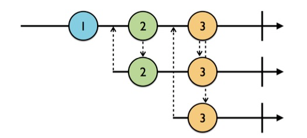
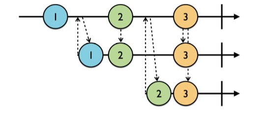
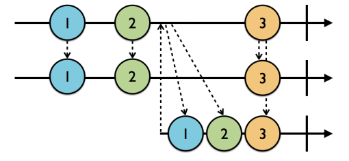

最近比较忙，更新得有点慢，望谅解。
### 什么是Subject？
上一章我介绍了`Observable`——一个功能就像一条数据流的类。这一章的内容比较简单，`Subject`和`Observable`还是挺相似的，如果说`Observable`是专门用来被订阅获取数据的一个“被动”的类，那么比起`Observable`，`Subject`倒是占据了一点主动。  
  
它可以作为一个被订阅者供给外部订阅，也可以作为一个观察者，接收事件，然后发出给订阅者。所以它要比`Obsavable`更加的灵活一点，按照我的理解，它应该是一种支持一边接收事件，一边接收订阅者的类。也就是说，我可以先创建一个`Subject`，不着急定制里面的事件（`Event`），然后先让它被某个订阅者订阅，再往里塞入事件，这样子也可以让订阅者作出响应。我觉得在上代码之前，徒有文字描述应该是相当抽象的了，但是在那之前，我还是得先介绍一下RxSwift里的四种Subjects。

* PublishSubject：可以不需要初始来进行初始化（也就是可以为空），并且它只会向订阅者发送在订阅之后才接收到的元素。  
* BehaviorSubject：需要一个初始值来进行初始化，因为比起`PublishSubject`，它会为订阅者发送订阅前接收到的最后一个元素，当然，新事件也会发送。  
* ReplaySubject：初始化的时候要指定一个缓冲区的大小，而它会维持一个指定大小的数组来保存最近的元素，当有订阅者订阅了，它会首先向订阅者发送该缓冲区内的元素。然后当有新的元素加入，也会发送给订阅者。  
* Variable：这是一个不太一样的`Subject`，它实际上等同于包了一层`BehaviorSubject`，它里面有一个`value`属性等同于最近接收的一个元素，但是它本身不继承自`Observable`。需要调用它自带的`asObservable()`方法进行转化后才能被订阅。  

> 注：我想你可能会好奇为什么我在介绍这四种`subjects`的时候老是提到**元素**这个词而不是**事件**这个词，**元素**实际上说的就是`next`事件中包含的元素。我会这么说的原因主要是上面提到的表现是`subjects`的主要表现，而它们都针对于`next`事件，一旦出现一个`error`或者`completed`的事件导致它们终结，它们的行为也会变得不一样。

### PublishSubject——一个只会收发新元素的观察者
因为不知道怎么用中文称呼`subject`相关的类，但是它的功能有点像一个针对于`Observable`数据流的观察者，所以我就称它为观察者吧！
为了方便测试，我们先写下一些功能代码：
```swift
enum MyError: Error {
    case anError
}

func print<T: CustomStringConvertible>(label: String, event: Event<T>) {
    print(label, event.element ?? event.error ?? event)
}
```
我前面提到，`subject`是一种可以一边收发事件，一边接收订阅的神奇物种，而`PublishSubject`是一种只对订阅者发出新元素的类，下面我将用代码来演示一下：  
```swift
    let subject = PublishSubject<Int>()
    subject.onNext(1)

    subject.subscribe { print(label: "PS)", event: $0) }
        .addDisposableTo(disposeBag)
    
    subject.onNext(2)

/*
输出：
PS） 2
*/
```
从这段代码里就可以看出来，**PublishSubject是只对订阅者发送新接收的信息的，而旧的消息则不会发出。**  
为了让这个原理更清晰，我们在上面的代码片继续添加如下代码：  
```swift
    subject.subscribe { print(label: "PS2)", event: $0) }
        .addDisposableTo(disposeBag)
    
    subject.onNext(3)

/*
输出：
PS) 3
PS2) 3
*/
```
所以，对`PublishSubject`新增了一次订阅，它并不会把之前接收的元素`1, 2, 3`发送给第二次订阅。给出它的示意图：  



> 向上的箭头代表着一次订阅，乡下的箭头代表着`subject`对订阅者发送元素。


### BehaviorSubject——一个会向每次订阅发出最近接收到的一个元素的观察者
`BehaviorSubject`是一个会向当前订阅发送最近接收的那个元素的功能类，因为有这样的要求，所以初始化一个`BehaviorSubject`一定要有一个初始值。  上代码：
```swift
    let subject = BehaviorSubject(value: 1)
    let disposeBag = DisposeBag()
    
    subject
        .subscribe { print(label: "BS)", event: $0) }            //BS) 1
        .addDisposableTo(disposeBag)
    
    subject.onNext(2)                                            //BS) 2
    
    subject
        .subscribe { print(label: "BS2)", event: $0) }           //BS2) 2
        .addDisposableTo(disposeBag)
    
    subject.onNext(3)                                            //BS) 3
                                                                 //BS2) 3
/*
输出结果：
BS) 1
BS) 2
BS2) 2
BS) 3
BS2) 3
*/
```
为了方便理解，我在每次订阅打印出信息的位置都额外添加了注释，以便让你看懂订阅后打印出对应信息的“位置”（或者说——顺序）。从上面就可以看出来，`BehaviorSubject`是会对订阅者发送最近的那次订阅的。给出示意图：  



### ReplaySubject——会向每次订阅发送一系列最近元素的观察者
`ReplaySubject`会自带一个缓冲区，所以每次初始化的时候需要赋给它一个缓冲区大小。每次它接收到新的元素，都会先存放到自己的缓冲区里，按缓冲区大小来存放指定数量的元素（实际上`BehaviorSubject`就是一个缓冲区大小为1的`ReplaySubject`），然后在每次订阅发生的时候，则向订阅者发送缓冲区内的所有元素，然后才发送新接收到的元素。给出一个缓冲区大小为2的`ReplaySubject`的示意图：  



给出样例代码以及输出：  
```swift
    let subject = ReplaySubject<String>.create(bufferSize: 2)
    
    let disposeBag = DisposeBag()
    
    subject.onNext("1")
    subject.onNext("2")
    
    subject
        .subscribe { print(label: "RS)", event: $0) }      //RS) 1
        .addDisposableTo(disposeBag)                       //RS) 2
    
    subject.onNext("3")                                     //RS) 3
    
    subject
        .subscribe { print(label: "RS2)", event: $0) }    //RS2) 2
        .addDisposableTo(disposeBag)                      //RS2) 3

/*
输出结果：
RS) 1
RS) 2
RS) 3
RS2) 2
RS2) 3
*/
```
  
### Variable——一个不太一样的Subject  
`Variable`实质上是一个对`BehaviorSubject`还封装了一层的`subject`，它本身并不继承自`Observable`，所以它并不能被订阅，它有一个`value`属性用于访问它最近（也是最后）接收到的一个元素，所以对于`Variable`你甚至不需要订阅就能访问到它的数据流里的元素。而为了订阅到一个`Variable`实例的数据流，你得通过它的`asObservable()`方法去获取到它底层的`BehaviorSubject`才可以进行订阅。  

并且，对于`Variable`而言，你无法像对其它`subjects`那样用`onNext(element)`、`onCompleted()`或者`onError(MyError.anError)`来让它收到一个新的事件，甚至，它根本没法接收一个`completed`或者`error`事件。你只能通过`Variable.value`属性来为`Variable`添加一个新的元素。
  
还有，由于它是基于`BehaviorSubject`的封装，所以初始化一个`Variable`对象的时候也需要指定一个初始值。  

```swift
    var variable = Variable("Initial value")
    
    let disposeBag = DisposeBag()
    
    variable.value = "New initial value"
    
    variable.asObservable()            //.asObservable() to access its underlying behavior subject
        .subscribe { print(label: "V)", event: $0) }
        .addDisposableTo(disposeBag)
    
    variable.value = "1"
    variable.asObservable()
        .subscribe { print(label: "V2)", event: $0) }
        .addDisposableTo(disposeBag)
    
    variable.value = "2"

/*
输出结果：
V) New Initial Value
V) 1
V2) 1
V) 2
V2) 2
*/
```

### Subjects是如何面对`completed`和`error`事件的？那`dispose()`呢？
文章也有点长度了，避免你忘记了我之前定义的一个枚举，我把它再定义一次：
```swift
enum MyError: Error {
    case anError
}
```
#### PublishSubject的情况
##### completed：
```swift
    let subject = PublishSubject<Int>()
    let disposeBag = DisposeBag()
    
    subject.onNext(1)
    
    subject.subscribe { print(label: "PS)", event: $0) }
        .addDisposableTo(disposeBag)
    
    subject.onNext(2)
    subject.onNext(3)
    
    subject.onCompleted()
    
    subject.subscribe { print(label: "PS2)", event: $0) }
        .addDisposableTo(disposeBag)
    
    subject.onNext(4)

/*
输出结果：
PS) 2
PS) 3
PS) completed
PS2) completed
*/
```
是的，就和`Observable`数据流的表现类似，当你向一个`subject`发送一个`completed`事件的时候，`subject`所拥有的数据流也会被标记终结，当你再往它推送新的元素，它也不会再发给订阅者。除此之外，它还将对新来的订阅者发送导致它终结的事件，这点对于所有的`subjects`都适用。而这也是为什么你会看到`PS2)`接收到了`completed`事件的原因（按照`PublishSubject`的功能，它不应该会发出一个订阅之前就接收到了的事件）。 
> 个人观点，`PublishSubject`在接收到`completed`或者`error`的事件的时候，表现得就像`BehaviorSubject`一样。

##### error:
把上面那段代码中的`subject.onCompleted()`方法替换为：  
```swift
subject.onError(MyError.anError)
```
效果和`onCompleted()`差不多，只不过会输出错误，就不多赘述了。  

##### dispose: 
`subjects`都是遵循于`Disposable`协议的，所以它们可以调用`dispose()`方法来析构自身，又或者用`addToDisposeBag(DisposeBag())`方法将它加入到垃圾袋里去将它析构。但是由于`dispose()`可以让`subject`立刻析构，便于我们看到析构后订阅的结果，所以我们就用它来进行实验吧！  
  
把上面那段代码中的`subject.onCompleted()`方法替换为：
```swift
subject.dispose()

/*
输出结果：
PS) 2
PS) 3
PS2) Object `RxSwift.PublishSubject<Swift.Int>` was already disposed.
*/
``` 
看到了吗？所以在`PublishSubject`被回收后，它并不会对已订阅的对象发送消息，但是对于后来者，它则会返回一条*对象已析构*的错误。（当然了，通过`.subscribe(onDisposed:{...})`的方法可以让既订阅者对析构“事件”进行响应）。  

#### BehaviorSubject的情况
它的表现和`PublishSubject`一致，不作赘述。  

#### ReplaySubject的情况
##### completed:  
```swift
    let subject = ReplaySubject<String>.create(bufferSize: 2)
    
    let disposeBag = DisposeBag()
    
    subject.onNext("1")
    subject.onNext("2")
    
    subject.onCompleted()
    
    subject
        .subscribe { print(label: "RS1)", event: $0) }
        .addDisposableTo(disposeBag)
    
    subject.onNext("3")
    
    subject
        .subscribe { print(label: "RS2)", event: $0) }
        .addDisposableTo(disposeBag)

/*
输出结果
RS1) 1
RS1) 2
RS1) completed
RS2) 1
RS2) 2
RS2) completed
*/
```
`ReplaySubject`和前两个`subjects`不太一样，它有一个缓冲区来装载最近接收的元素。在它接收到`completed`或者`error`事件的时候，他会向既订阅者发送该事件；对于新的订阅，它将先发出缓冲区的元素，接着再将导致数据流终结的对象也发送出去。它也有和前两个`subjects`一样的地方，那就是它被终结后，不会再接收新的元素。

##### error:  
如前文所说，当你向一个`ReplaySubject`发送一个`completed`或`error`事件，会导致它的数据流终结，此后，若再订阅它，`ReplaySubject`会先向订阅者发送缓冲区内的所有元素，再将导致它终结的`completed`或者`error`事件发送给订阅者。

##### dispose:
`ReplaySubject`在析构以后的表现和前两个`subjects`一样，它会通知既订阅者调用它们订阅了的`onDisposed:{}`“事件”里的闭包（假如订阅了的话）。而对于新来的订阅者，它不会像对待`completed`和`error`那样发送缓冲区内的元素，而是仅仅抛出一个“对象已析构”的错误。

#### Variable的情况
对于`Variable`而言，它没办法终结，所以也无从讨论。但是它有它强大的地方，它既可以被订阅用来长期获取它的数据流里的数据，也可以被外界一次性的访问来满足某些需求（`Variable.value`既可以当setter塞入新元素，也可以当作getter访问数据流中最新的一个元素）。  

### 总结
`Subjects`和`Observable`非常相似，导致我们有点难以区分它们。但是其实是有差别的，`Observable`的表现更像一条没有表情的等待着你处理的数据流，而它也是`Subjects`的根本所在，而`Subjects`则提供了你用不同的方式来操作一条数据流——`Observable`。这也是为什么我说`Observable`比较被动，而`Subjects`要偏主动一些的原因。简单来说，`Observable`的使用流程大概是*接收-使用*；而`Subjects`则是*接收-采用自身的策略发出-使用*。
  
在这里我们还可以探寻一下它们的实用价值：  
  
`PublishSubject`：总是发出最新的信息，你可以在你仅仅需要用到新数据的地方使用它，并且在你订阅的时候，如果没有新的信息，它将不会回调，在利用它来和界面绑定的时候，你得有一个默认的字段放在你界面上，以免界面上什么都没有。  
  
`BehaviorSubject`：除了发出新的信息，还会首先发出最近接收到的最后一个元素。这里我们可以以微信（没有收广告费的）举个例子，譬如微信首页的tableview的cell里会显示最近的一条信息，而在这你就可以通过`BehaviorSubject`来订阅，从而用这条最近的信息作展示，而不需要等到新的信息到来，才做展示。  
  
`ReplaySubject`：可是如果你现在订阅，却要获取最近的一批数据——譬如朋友圈，那该怎么办？显然只能依赖于`ReplaySubject`了吧？  
  
这就是关于这一章我全部的心得体会了。


