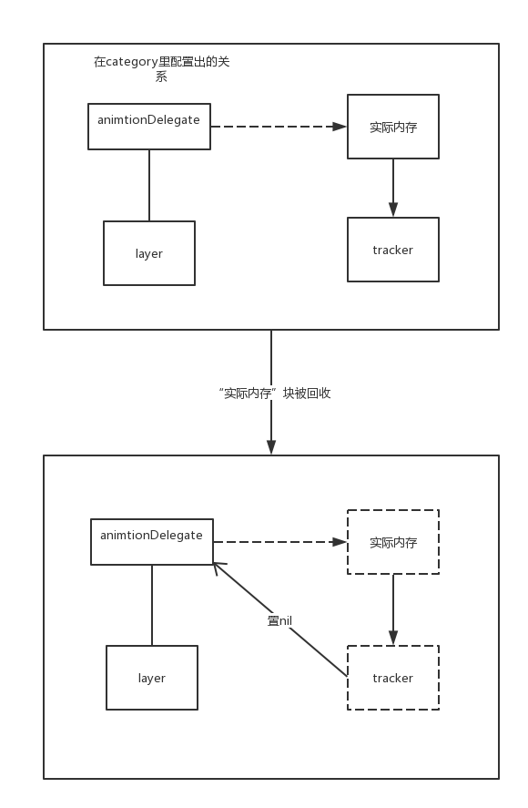

### 简介
最近在实现一个需求，为了使代码看起来更干净整洁，我给CALayer写了一个category，里面有一个`animationDelegate`的weak属性，由于`layer`的释放时间要比`animationDelegate`晚，所以`animationDelegate`得有在内存回收时自动置`nil`的的功能。然而，用过category创建属性的我们都知道，category创建的属性的setter和getter都只能是动态生成的(`@dynamic`)的，并且在category里我们不能添加ivar，所以只能通过runtime的形式为category里的属性配置对应的ivar。而在runtime的属性绑定策略里和引用计数有关的只有`retain、assign、copy`三种方式，我们知道要使绑定的属性不增加引用计数，只有使用assign标识，但是assign的属性并不会在`dealloc`以后自动置nil。所以当我的`layer`的生命周期大于`animationDelegate`时，就会出现野指针访问的问题。那么现在提供一种在category里实现weak属性的方法。  

其实这篇文章也是相当于对[另一篇文章](http://www.zhimengzhe.com/IOSkaifa/190588.html)的记录。因为方法是从那里学来的。  
### 实现思路
要实现这个功能，其实关键的问题就是：“我该如何知道`animationDelegate`所指向的对象何时被销毁呢？”。其实就是要从category里捕捉到`animationDelegate`的`dealloc`方法，并且还不要从外部直接修改`animationDelegate`的`dealloc`方法。  
那么，该如何做到呢？  
方法就是，我们可以实现一个类专门用来追踪`animationDelegate`对象的`dealloc`方法，并且这个类可以直接私有地创建在category的.m文件里，于是我现在姑且为它起名`__DeallocTracker`类。给它配置一个block作为属性，然后让它在它的`-dealloc`方法里调用该block，接着在category里创建`__DeallocTracker`的对象，将属性置`nil`的方法传进`__DeallocTracker`的block里作为回调。贴上代码：  
```objc
		@interface __DeallocTracker : NSObject
		
		@property (nonatomic, copy) DeallocBlock deallockBlock;
		
		- (instancetype)initWithDeallocBlock:(DeallocBlock)block;
		
		@end
		
		@implementation __DeallocTracker
		
		- (instancetype)initWithDeallocBlock:(DeallocBlock)block {
		    self = [super init];
		    if (self) {
		        self.deallockBlock = block;
		    }
		    return self;
		}
		
		- (void)dealloc {
		    if (self.deallockBlock) {
		        self.deallockBlock();
		    }
		}
	
	@end
```
最终通过在`CALayer`的category里的配置block的内容——`置nil CALayer`的属性，接着再将`__DeallocTracker`绑定到`animationDelegate`上，那么在`animationDelegate`所引用的对象被释放时，自然也会调用到`__DeallocTracker`的`-dealloc`方法，此时自然会`置nil CALayer`下的`animationDelegate`属性。  
  
贴上`animationDelegate`的setter实现：  
```objc
- (void)setAnimationDelegate:(id<Protocol>)animationDelegate {
  __DeallocTracker * tracker = [[__DeallocTracker alloc] initWithDeallocBlock:^{
    objc_setAssociatedObject:(self, &animationDelegateKey, nil, OBJC_ASSOCIATION_ASSIGN);
  }];
  objc_setAssociatedObject(animationDelegate, (__bridge const void *)(tracker.deallockBlock), tracker, OBJC_ASSOCIATION_RETAIN_NONATOMIC);
  objc_setAssociatedObject(self, &animationDelegateKey, animationDelegate, OBJC_ASSOCIATION_ASSIGN);
}
```
贴上示意图：
  
收工！


