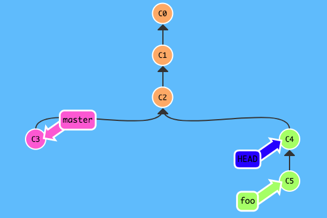
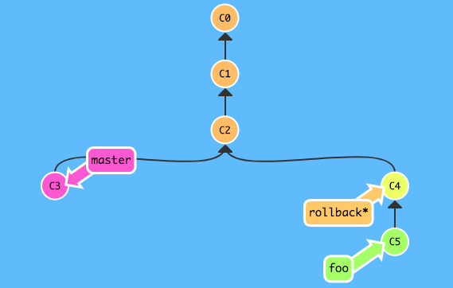
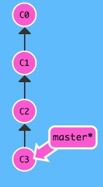
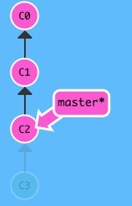
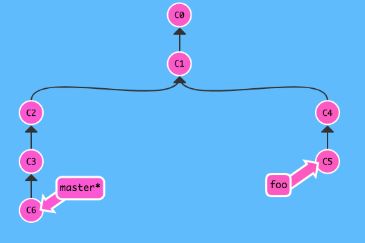
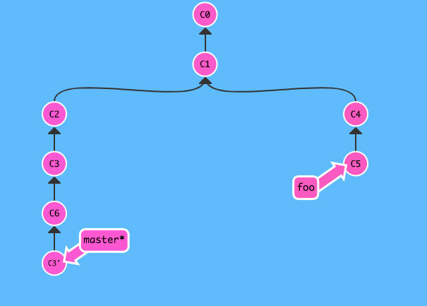
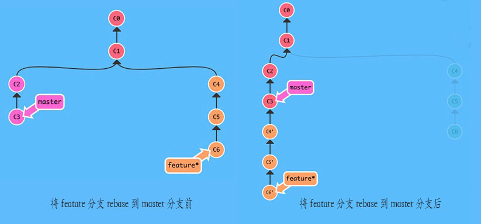
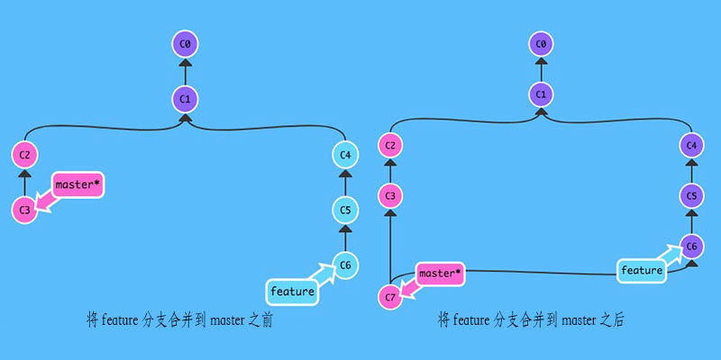

这是一篇最近在学习`git`的时候有感而发的文章，因为`git`里有许多不同的命令，但进行操作后可能会产生相同或者近似的行为，打算写一个系列的文章来捋清楚或者说记录个中的关系，全系列分为三篇文章，而每篇文章会讲两个主题。  

> 文章中所有的示意图中，当前检出的`git`分支为在分支名右侧加了\*号的分支。如：master*

## 回滚代码的利器——revert、reset和checkout
回滚代码是日常开发中的一个不常使用，但是又不可或缺的功能。在git里，有三个命令是可以用来回滚代码的，它们分别是`revert`、`reset`和`checkout`。

### checkout式回滚
实际上单说`checkout`是一个回滚代码的命令又并不是那么准确，当我们`checkout`到某个提交点的时候我们会造成分离的`HEAD`指针（[Detached HEAD](https://git-scm.com/docs/git-checkout#_detached_head)）的情况，如果不创建新分支而持续工作下去，是有可能会导致工作记录丢失的。因为`checkout`实际上是检出`HEAD`指针到某个分支或者某个提交点上，而在工作副本看到的代码即是`HEAD`指针所指向的提交。所以当你`checkout`某个branch（以`master`为例）的时候，在git里的实际是`HEAD->master->0eacb...(master的最新提交)`，但是假若你直接检出到某个提交，则是`HEAD->ac0ef...（你检出的提交）`。  
> 关于git里的HEAD指针，想了解更多可以看[这片文章](https://blog.csdn.net/claroja/article/details/78858533)。  

   
（代表commit的理论上应该是一串SHA-1码，这里为了方便和简洁，就用C1、C2、C3...来表示吧：P） 

所以，使用`git checkout`来回滚代码的时候，最好同时配上`git branch`来创建分支，来保证你今后的工作记录不会丢失。  

  

或者你也可以使用`git checkout -b <branchName> <commit SHA-1 code>`来直接于某个提交点创建并切换到指定分支。  

利用`checkout`来回滚其实优缺点很明显，优点就是回滚代码不需要对工作中的分支进行操作，不会对它有任何改动，可以用来做一些“不太确定的回滚操作”——或许一个功能你想到了更好的实现方式，你想试一试，但是又想保留当前的工作代码；缺点则为为了保证不会出现分离的`HEAD`指针的情况，不得不再创建一条分支，多次使用后可能会导致分支过多。  

`checkout`式回滚是一个不会对正在工作的分支进行改动的回滚方式，那么`reset`和`revert`命令呢？  

### git reset 
`git reset <commit SHA-1 code>`命令是将当前检出的分支重置于指定的提交处。注意：这是一个直接修改分支历史的命令，并且由于它可以将当前分支重置至所有提交历史的任意提交点（重置至一个非当前分支的历史的提交点也是可以的），所以也让它的功能并不仅仅局限于回滚，但是在这里，我们只讨论用它来进行代码回滚的影响。  

首先，`reset`会有三种重置分支到某个特殊提交点的方式，分别是`--soft`、`--mixed`、`--hard`，无论是哪一种方式都会造成分支被更改，三种方式只是影响操作的区域。`soft`只对版本库（也就是分支历史）进行重置，并不会影响暂存区以及工作区；`mixed`既重置分支历史，也重置暂存区，但是并不会对工作区造成影响；`hard`则是会同时操作三个区域。（tips：如果对`git`的工作区、暂存区和版本库不太熟悉可以看看[这篇文章](https://www.liaoxuefeng.com/wiki/0013739516305929606dd18361248578c67b8067c8c017b000/0013745374151782eb658c5a5ca454eaa451661275886c6000))  

那么，很明显的是`reset`是一个会改动分支历史的操作，所以它是相对危险的。
  
```
git reset C2
```
  

从图中可以看出来，`reset`改动了`master`的历史，其次也造成了悬垂提交`C3`的出现，而如果不建立分支来保存`C3`这个提交的话，在下一次`git`进行垃圾回收的时候，就会清除掉该提交了。并且，倘若你正在和别人进行协作开发，不巧的是`C3`也已经被上传了，那么你就最好不要对`master`进行`reset`了，因为改动了`master`的历史会让你无法`push`你的新改动到服务器（实际上还是可以强制`push`到服务器，但是这样会令和你一起协作的朋友无法拉取新的提交，小心惹恼他们喔：P）。  

但是如果你的提交都仍然在本地，或者这仅仅只是你的个人项目，而有一段历史提交你并不想要或者你并不在意，那么你可以用`reset`来改变当前分支的历史，从而达到回滚代码的效果，同时也把历史记录给回滚了。  

### 利用revert来回滚代码
比起使用`checkout`、`reset`来进行代码的回滚操作，我更觉得`revert`就是一个专门为回滚代码而准备的命令，毕竟实际上`checkout`和`reset`有超出“代码回滚”之外的额外用途，然而`revert`并没有，并且它不会改动分支历史，它的用法长这样：  
```
git revert <commit SHA-1 code>
```
`revert`命令后面由你所指定的提交还不能是当前分支历史以外的点，只能是分支历史当中的提交。  
  
（例如图中的`master`分支不能`revert`图里的`C5`）  

而在你`revert`一个提交的时候，实际上`git`是把该提交“逆向”再提交一次，生成一个新的提交点，但实际上，工作区里已经回滚了指定提交的改动了。正因为`revert`回滚代码的整洁性，使它成为了团队协作时，用来进行代码回滚的优良方式，而就算你是在你的个人项目中工作，也可以使用它，没有毛病。  

但是`revert`同样也有缺点，就是它一次只能回滚一个`commit`，并不能一段历史一段历史的进行回滚。但是它可以回滚得更加确切，像`reset`和`checkout`都只能回滚**最新的点**到**指定的点**的一整段历史，而`revert`可以自己来挑选**某一个提交**用以回滚。  

下图为在`master`中执行`git revert C3`后的状况：  
  

## 合并代码的两种方式——rebase和merge
日常开发中使用的比较多的另外一个功能就是分支合并了，而`git`为我们提供了两种方式来进行分支合并，一个是`rebase`，一个则是`merge`。  

### rebase——一种“简洁”的代码合并方式  
`rebase`的官方中文翻译是"变基"，实际上，当你有一条功能分支开发完成，想要并入主干的时候，你可以选择使用`rebase`来做这件事。使用`rebase`从`feature`分支变基到`master`分支会使得历史看起来都在一条直线上，没有“岔路”。  

  
```
git rebase master
```

`rebase`实际上就是以`master`与`feature`分支开始“分岔”的提交点开始计算，将`feature`分支中新增的所有提交全部移动到`master`分支的最新提交点后。  

从图中不难看出来，一般来说的合并，都是将功能分支合回主干，但是从图中的`rebase`实际上相当于将主干中的新提交并入到功能分支中，而实际上没有更新`master`分支。合理的做法是再检出到`master`分支然后执行：
```
git merge feature
```
就可以了。  

但是这个操作并不是单纯的`rebase`，这是综合了`merge`命令的一个操作，那么比起这个方法，还有更好的方法吗？有的，那就是将`master`分支`rebase`到`feature`分支之上，只需`rebase`一次，无需后续的`merge`操作，就可以达到上面的两次操作加在一起的效果。不过，这个方法实际相当危险，因为它改动了`master`的历史（`feature`的提交历史间插在了`master`的过去）！一般来说功能分支都是一条比较“私人化”的分支，而对比于它，主干分支则显得比较“公共”，所以在对`rebase`造成的最终影响的判断上，功能分支更加容易判断出有无问题，而主干的影响面相当广，所以一般来说，如果想要创造“一条直线”的历史而又不想造成太大的负面影响，最好把功能分支`rebase`到主干分支上，再合并回主干！  

但无论如何，`rebase`都会改动分支的历史，所以如果你对它还不够熟悉，建议不要轻易使用。尽管它可以创造整洁的“直线”式提交历史，但是它对历史的改动也让“追查旧账”变得不那么容易。  

### merge——合并分支的常规操作
`git merge <branch name>`命令在动词`merge`后面可以跟上一个介词from，这会更贴近与它的意思。因为`merge`实际上就是将另一分支的所有当前分支没有的提交合并入当前分支，并产生一个新的提交点，而作为对比，`rebase`的行为看起来更像应该在后面加上一个介词to，毕竟`rebase`是将当前分支所有新的提交变基到指定分支之上。从行为上来说确实是这样，但是结果上发生了变更的分支都是当前分支。  

而使用`merge`来合并代码，它会保留分支历史原有的“岔路”，所以一旦分支多起来，分支历史看起来就不那么的整洁。但是相对地，它可以保留住所有的历史，便于在未来排查问题。  

  

## 总结
综上所述，所提到的命令，有它们相近的地方，但是其实又是有所区别的，一个不小心，你就容易将它们混淆。而当你足够了解它们的时候，你可以结合它们的优缺点，发挥出各个命令应有的效果，从而做到扬长避短，发挥出`git`的最大效能。

