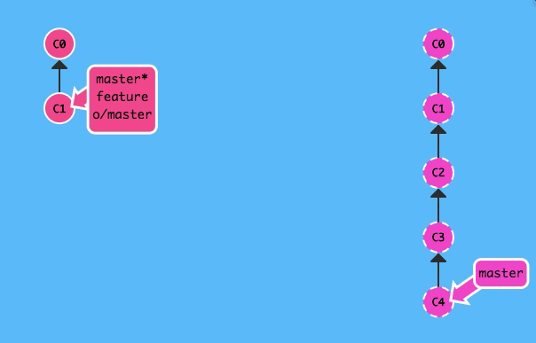
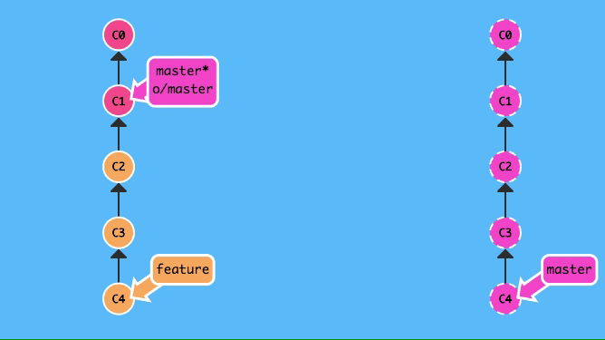

## pull命令详解
初看`pull`命令，当我们运行`git pull`的时候，似乎像是将当前本地分支所跟踪的远程分支的新内容下载至当前的本地分支上，而它有别于`fetch`，`git fetch`更像是刷新一下远端的分支的新提交信息，而并没有真正的下载所有的新内容。  

但是实际上，并不是这样的。  

`git fetch`本身就是一个下载命令，但是`fetch`只会更新本地的远端分支，也就是诸如`origin/master`, `origin/feature`等带有远程仓库前缀的分支，所有的远端分支的引用信息被存在`.git/refs/remotes/`里，而这些分支本地的操作人是不带有写权限的，所以你不能`checkout`到它们之上，更无法在远端分支上进行`commit`, `merge`, `rebase`, `revert`, `reset`等带有“写”性质的操作。   

尽管如此，远端分支也不仅仅只是一个仅有历史信息的列表，在它的提交历史里的所有提交对象它都包含，并且拥有每个提交最终所指向的内容，所以无论是新改动还是新文件，在本地运行`git fetch`命令以后，它们就已经被下载下来了，并非仅仅加载提交信息，在运行了`fetch`命令以后，我们可以再使用`merge`命令将任意的远程分支合并到当前分支来。  

`pull`命令的表现实际就是`fetch`命令和`merge`命令的集合。首先假设你当前在`master`分支上工作，并且该分支追踪着远端`origin`的`master`分支，直接运行`git pull`，`git`会首先利用`fetch`命令下载`origin`上的`master`分支的新提交，然后再用`git merge origin/master`命令来将新下载的提交合并到本地`master`分支上。  

所以说，`git pull`并非唯一指定的下载命令，而是由`fetch`和`merge`命令结合组成的命令，`fetch`才是`git`里真正的**下载**命令。  

但这也只是`git pull`的默认行为，可以通过加入参数`--rebase`来将`pull`的默认`merge`行为改成`rebase`。
```
git pull --rebase
```

## fetch、push、pull命令带参数时的用法与区别
### fetch
`fetch`命令后面可以加上远端名，甚至可以指定分支。大概长这样：  
```
git fetch [remote name] [[remote branch]:(local branch)]
```
> 注：中括号内的参数是可选的，小括号内的参数是必填的

如果你不指定远端的话，`fetch`会下载默认的远端上的所有的新的分支及提交到本地上；但如果你指定了远端的话，你还可以选择是否指定分支来进一步细化要让`git`去下载的内容。并且，如上命令所示，你甚至可以让非指定的本地分支所跟踪的远程分支的内容下载至你指定的本地分支上。并且，本地对应的远程分支不会有任何更新！  

例子（虚线部分代表的是远端上的提交历史）：  
```
git fetch origin master:feature
```


同时如果你指定了一条本地不存在的分支，那么`git`会先将这条本地分支创建出来，再将远端的指定分支的新内容下载到该分支上！  

例子（虚线部分代表的是远端上的提交历史）：  
```
git fetch origin master:foo
```

（这个例子是先创建了本地`foo`分支，再将`origin`上的`master`分支下载至本地`foo`分支）  

这个命令甚至可以不指定远端的分支名，像这样：  
```
git fetch origin :bar
```
它的作用很奇特，它不会执行任何的下载功能，它只会在本地创建一条`bar`分支（如果本地不存在`bar`的话）。  

### push
`push`命令也和`fetch`一样，带有指定远端和分支的额外功能，甚至连命令都是相似的，唯一不同的地方就是它们的方向不同，毕竟`fetch`是下载，而`push`是上传嘛！  
```
git push [remote name] [[local branch]:(remote branch)]
```

和`fetch`相似，该命令会将制定的本地分支的新内容上传到指定远端的指定分支上。当指定了一条远端不存在的分支的时候，`git`则会在远端先创建该分支，然后将本地分支的内容传输至远端的指定分支上；但是最奇特的是（也是与`fetch`完全不同的），如果不指定本地分支的话，`git`则会删除远端的指定分支！  

```
git push origin :master
```
例如这个命令，是会导致远端的`master`分支被删除的！  

### pull
`pull`命令也有如上形式的命令：  
```
git pull [remote name] [[remote branch]: (local branch)]
```
但是正如前面我所提到的那样，`pull`就是`fetch`和`merge`的组合。倘若你执行如下命令：  
```
git pull origin master: feature
```
就相当于：  
```
git fetch origin master: feature & git merge feature
```
也就是说，上述命令相当于将远端`origin`上的`master`分支的新内容下载至本地的`feature`分支，紧接着再将`feature`分支的内容合并到当前所在的分支。  

而如若不指定远程分支，则该`pull`命令的表现和`fetch`是完全一致的，都是仅在当前`HEAD`引用所指向的commit创建一条对应名字的本地分支。

