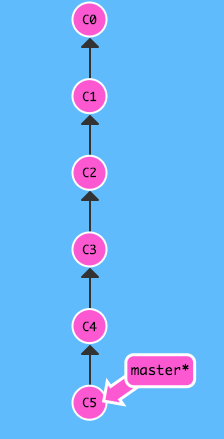
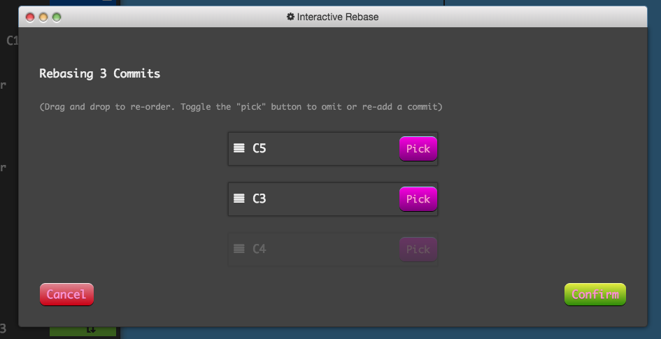
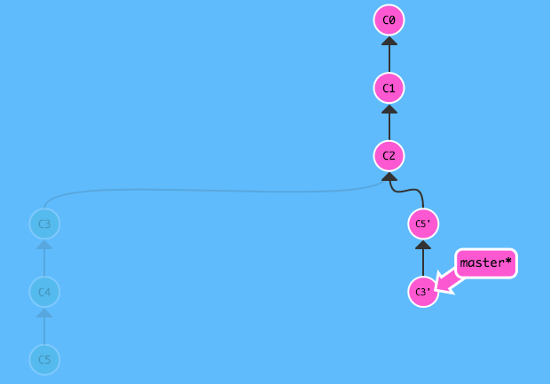
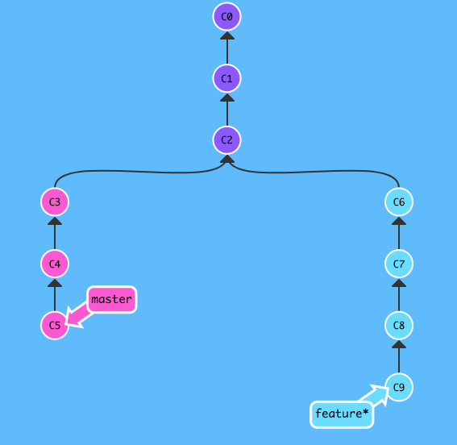
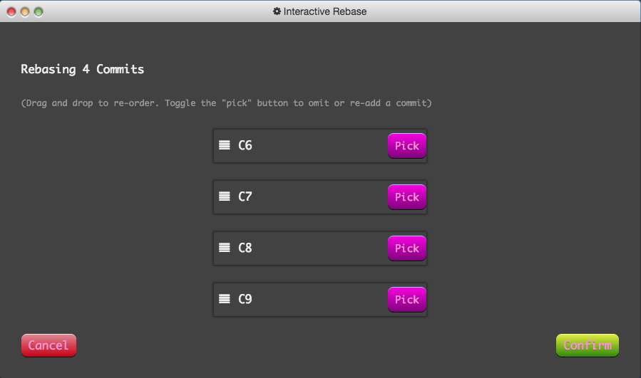
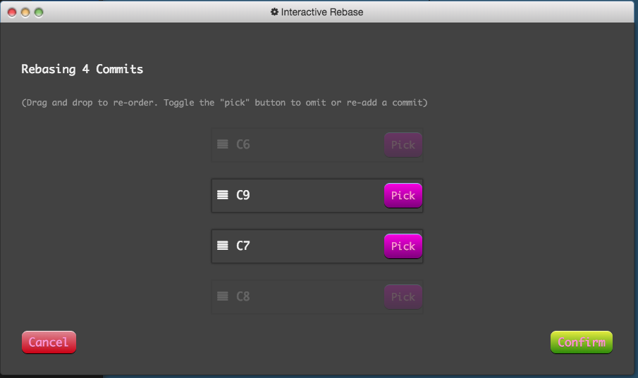
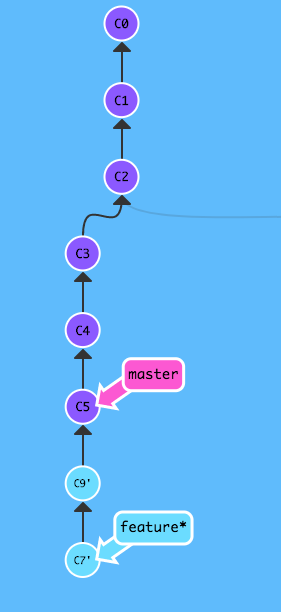
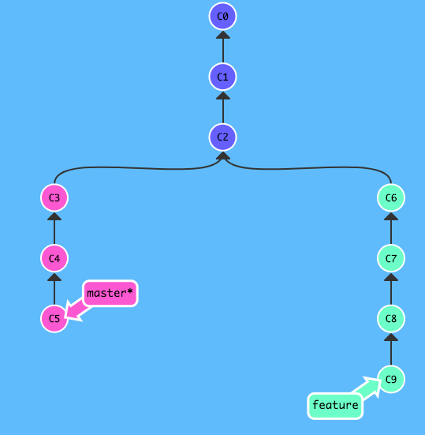
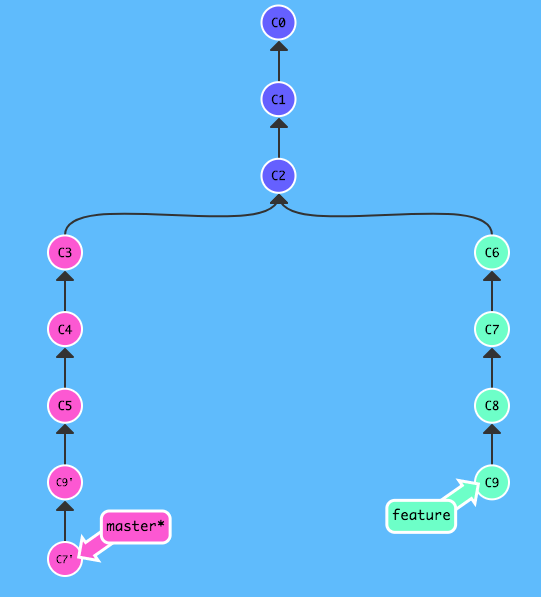

回顾了这个系列的上一篇文章，讲的是分支的合并与回滚操作之中，那些作用相似的命令。而在这篇里，则说几个用于分支上的高级操作，同样，他们之间也有着或多或少的相似性，容易混淆或者记错，在这里做下记录，并且对比他们的差异。  

## 微调分支的历史——交互式rebase和cherry-pick
说到微调分支的历史，交互式`rebase`和`cherry-pick`无疑就是用于这个功能中的佼佼者，它们可以篡改分支的历史（毫无疑问），详细的说，它们能够遴选某个提交而舍弃不需要的提交，也可以更改提交的顺序。总之，如果能灵活运用的话，它们的功能是相当强大的。  

### 交互式rebase  
交互式`rebase`在`git`里由以下命令触发：  
```
git rebase -i 或者 --interactive [commit SHA-1 code]
```
交互式`rebase`和普通`rebase`不太一样，交互式`rebase`可以指定任意提交点（除自己以外的分支也是可以作为目标的，当然`HEAD`提交也是可以的）作为目标，包括当前分支所包含的过去提交点；反观普通`rebase`，只能以另外一条分支或者当前分支历史以外的提交点作为目标。  

而在功能上，它们也是有质的区别的。  

据[该系列中的上一篇文章](blogpost/捋一捋git里那些操作近似的命令们儿之间的关系（一）——回滚与合并/捋一捋git里那些操作近似的命令们儿之间的关系（一）——回滚与合并.html)所述，我们可以知道普通的`rebase`主要是用来实现和分支合并（`merge`）非常相似的功能——将两个分支所有的提交点并入到一个分支上，只是语义上有所不同，`merge`更像是**“把那条分支里‘我’没有的提交拿过来”**；而`rebase`则像**“‘我’把这条分支上的新提交基于那条分支里的最新提交来继续工作吧”**！  

但是交互式`rebase`不同，它实际也具有普通式`rebase`所包含的功能，但是如果我们仅仅只用交互式`rebase`来进行代码合并，也未免太屈才了。接下来来看看它真正能做的事情吧！  

> 下述的图片中，当前所属分支会在分支名右侧有一个星号（*） 

#### 基于当前分支的历史进行交互式rebase 
为了方便讲解，先上一副图：
  

在一条呈直线的`master`分支上，有6个提交点，如果此时我执行这个命令，它会发生什么呢？  
```
git rebase -i HEAD~3
```
  

`git`会像这样弹出一个可视化的弹窗，图里比较“优雅”，实际在终端像这样执行命令的话则会唤起vim，里面有着一些可视化的数据，和上图类似，你可以决定`pick`或者`drop`一些提交，并且还可以调整它们的先后次序，最后将你操作好的一串记录从新加之于你所指定的提交之后。上述命令指定的提交是`HEAD~3`，也就是`HEAD`再往前数三个提交，即`C2`。  

> pick指需要这个提交，drop指放弃这个提交  

继续上述的步骤，我再在`git`弹起的GUI界面中进行如下操作：  
  
（`drop` C4提交，并将C5和C3的顺序互换）  

  
保存了上面GUI窗口的改动后，交互式`rebase`将完成，而正如图中所示，master分支被“重构”了，基于C2提交，后续的提交历史则和我们刚刚在GUI窗口操作后的提交历史是一致的。而原有的`C4`则变成了游离的提交了。  

#### 基于其它分支进行交互式rebase  
交互式`rebase`的特点在于它可以基于当前分支所包含的一个提交点进行操作，当然它也像普通的`rebase`一样，可以基于当前分支所不包含的提交来进行。下面就直接基于一条有新的提交的分支来进行一次交互式`rebase`吧！  

首先假定有一条`master`分支和一条`feature`分支，并且自C2提交以后，它们俩都有着各自不同的提交。
  

现在在`feature`分支上对`master`分支进行交互式`rebase`，出现了那个熟悉的GUI窗口：  
  

里面出现了C6到C9的的提交供我们进行操作，对比发起交互式`rebase`前的那幅分支历史图，我们可以发现这些可操作的提交取决于**发起分支**和**目标分支**最近的交点。实际上这些提交就是**目标分支**所没有但是**发起分支**所拥有的，和普通`rebase`一样的是，它依然是将**目标分支**所没有的提交变基到**目标分支**上，只是最终结果作用于**发起分支**上。但是，由于这个GUI窗口的出现，让我们在`rebase`的最终结果产生之前，多了一些微操的权利。  

一般来说，不带参数的运行`rebase`命令，结果就是将C6、C7、C8、C9变基到C5之后。但是交互式`rebase`让我们在变基之前，可以对C6、C7、C8、C9进行遴选和排序。假设C6和C8两个提交仅仅是添加了log信息以便于开发的提交，我需要的恰恰是C7和C9，而不知怎地，我认为C9从提交顺序上理应排在C7之前，面对这种情况，交互式`rebase`无疑是一种相当好的选择。  

在GUI窗口中进行操作：  
  

结果：  
  
最终结果作用在了`feature`分支上，并且变更了`feature`的历史，还造成了游离的提交。

### cherry-pick
`cherry-pick`在`git`的官方中译是*遴选*，这个词我在交互式`rebase`中也多次使用了，因为这两个命令所达到的功能是非常相似的，核心就是遴选提交。但是比起`cherry-pick`，交互式`rebase`可以一次性操作一批提交，并最终添加至**目标分支**的末端，结果表现于**发起分支**。而`cherry-pick`则不然，`cherry-pick`自始自终都只能对单个提交进行操作（当然你可以在命令中指定多个提交），如果你将`cherry-pick`的目标设定为分支，`cherry-pick`的目标则是分支中最新的提交。  

举个例子，同样是一条`master`分支，一条`feature`分支，但是不同的是这次我们`checkout`到`master`分支上：  
  

和之前假设的条件一样：  
> 假设C6和C8两个提交仅仅是添加了log信息以便于开发的提交，我需要的恰恰是C7和C9，而不知怎地，我认为C9从提交顺序上理应排在C7之前  

面对这个情况，我们可以用`cherry-pick`来遴选C7和C9两个提交，并且在命令中安排一下它们的顺序。  
```
git cherry-pick C9 C7
```

最终达到了和上述的交互式`rebase`操作一样的效果。  
  

只不过这次，最终结果作用在了`master`分支上。可见，`cherry-pick`的语义像是“从那条分支上取出相应提交到‘我’这条分支上来”；交互式`rebase`则像是“将‘我所有的提交’作出筛选和排序，然后变基到那条分支上”，就像是from和to的对应，只不过两个命令的最终作用到的分支都是当前所处分支，也就是**发起命令的分支**。  

回顾`merge`和`rebase`，`merge`是将指定分支中新的提交合到当前所在分支的行为，`rebase`是将当前所在分支的新的提交变基到指定分支去，一样是相似的功能，from和to的对应关系。  

从这个角度来看，交互式`rebase`和`cherry-pick`的对应关系和`merge`和`rebase`的对应关系很相似。既是功能相似但又有所区别的。  

## 指定tracking branch的三种方式  
在`git`里，如果你的仓库有一个远程仓库的话，那么理论上你的仓库里就会存在着本地分支跟踪着远端的某条分支，比如本地的`master`跟踪着`origin/master`，而在确认了这个设定之后，你的`push`和`pull`才不会需要参数来驱动，让你可以直接就将`master`的提交`push`到`orgin/master`上，因为它已经有了默认的配置。  

> 虽然实际上，`origin/master`也是一条本地分支，但是你只需要知道它的语义就是`origin`仓库里的`master`分支就行了，因为在本地你只对这种分支具有读的权限，你不可以`checkout`到它身上去直接改变它的历史，你只能先操作本地的tracking branch，再通过`push`来改变远程分支

在`git`里，有三种方式可以指定tracking branch，一种可用于创建分支时指定——用`checkout`命令搭配参数完成，一种可以在随时指定或者更改一条本地分支所跟踪的远程分支——用`branch`命令搭配参数完成，最后一种是用`push`命令搭配完成的，也是可以随时指定或者更改一条本地分支所跟踪的远程分支，但是它在完成了指定远程跟踪分支这个功能之后却会扎扎实实地执行一次推送本地新commit到远端的功能，所以它实质是一个复合命令，不仅仅是简单的指定tracking branch。  

### 创建分支时指定tracking branch
```
git checkout -b <branch name> [tracking branch name]
```
上述命令中，`<>`中的内容表示是你必须填入创建的内容，`[]`中的内容代表可选的。  
在`checkout`命令中加入`-b`参数，代表着创建一条分支并切换过去，在这个命令的最后还可以指定一条远端分支用来被创建的分支跟踪。  

假定我有一个本地仓库，添加了一个远端仓库`origin`，上面有一条`master`分支。这时候我在本地仓库执行如下命令：  
```
git checkout -b foo origin/master
```
终端就会输出如下log：  
```
Branch 'foo' set up to track remote branch 'master' from 'origin'.
Switched to a new branch 'foo
```
这时候，你在本地`foo`分支作出的所有新的提交，在你执行`git push`命令之后，`foo`里的新提交会被推送到远端的`master`分支去；而当你执行`git pull`命令之时，远端的`master`分支里的新内容则是被下载并合并到本地的`foo`分支之上。  

### 随时指定/更新tracking branch  
```
git branch (--set-upstream-to=<remote branch name> | -u <remote branch name>) [local branch name]
```
同理，`<>`中的内容表示是你必须填入创建的内容，`[]`中的内容代表可选的，如果你不指定本地分支名的话，这个命令就默认将当前`HEAD`指针所指的本地分支所跟踪的远程分支更新为你指定的远程分支。并且对于这个命令，在参数上你可以选择使用全称`--set-upstream-to=<remote branch name>`或者简写`-u <remote branch name>`。  

和上述需求一样，我有一条`foo`分支，想要跟踪远端的`master`分支，我可以用一下命令：  
```
git branch -u origin/master foo
```

终端就会输出：  
```
Branch 'foo' set up to track remote branch 'master' from 'origin'.
```

### 在远端分支未创建时指定跟踪分支  
上述的两条命令都无法指定一条在远端还未创建的分支来被本地的分支追踪，鉴于这种情况，`git`为我们提供了一种带参数的`push`命令来将一条本地分支的历史推送到远端并创建一条远端分支，最后这条本地分支还会追踪远端分支的变化。命令如下：  
```
git push <remote name> [-u | --set-upstream] <local branch name: remote branch name>
```

但是，如果你指定的远端分支如果是存在的话，这条命令也是会成功执行的，它会将你指定的对应的本地分支里的新内容推送到你所指定的远端分支上，并将本次命令中的本地分支跟踪远程分支。  

