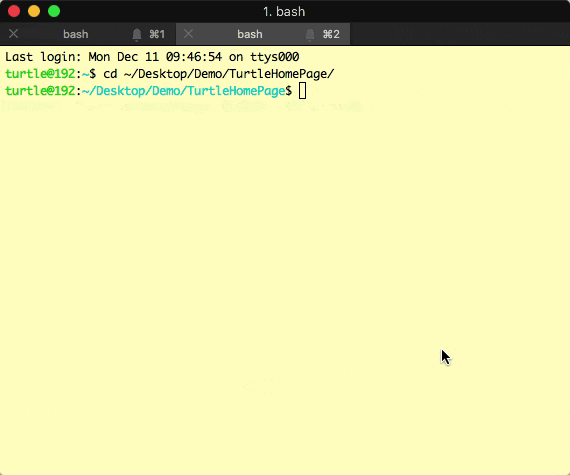

耗时一个半月，终于在跨年之前完成了我的博客的制作～  
这个博客，是由[Turto](https://github.com/dark19940411/TurtleHomePage)生成的。而**Turto**就是由我自制的一个用来生成我的网站的工具。
它大概长这个样子：  

# 制作的缘由
一个很关键的原因是在3月份的时候，我的旧博客引用的评论系统多说倒闭了，我当时的博客是由hexo生成的，使用的主题是[TKL](https://github.com/SuperKieran/TKL)，它只支持多说作为评论系统。然后迫于无奈之下，我打算更换主题，没想到把自己的hexo弄挂了（折腾了两三周也没折腾好），所以我就把hexo生成的博客给搁置了，暂时在简书上更新博客。后面想到今年自己也学了些前端的知识，干脆弄一个自由度和可控度更高的个人博客吧，于是我就制作了Turto，还有我自己写的页面模板。  

另外一个原因是我想找一个项目实践一下自己的`js`，毕竟纸上得来终觉浅嘛。

# 声明
如果你有关注过[王巍](https://onevcat.com)，不免会发现我的页面的样式和他的非常相似，是的，为了方便快捷而且美观，我在我的模版里大量拷贝了他的主题[Vno - Jekyll](https://github.com/onevcat/vno-jekyll)的样式，并且在我的博客对应的[github.io](https://github.com/dark19940411/dark19940411.github.io)下做了相关的License声明，正如他所要求的那样。  

# Turto 
Turto目前支持三个参数，分别是`g(generation)`, `n(new)`, `c(clear)`。用来生成页面、新建文章、清除生成结果用。  
它由纯`node.js`书写，因为我的初衷是用来他将自己的博客工程化，所以没有将它写得像[hexo](https://hexo.io/zh-cn/index.html)那么有普适性，也没有把它写成一个node package，目前Turto只能面向我的模板工作。  
写下Turto，主要是为了让我对我的博客有更高的控制度（就是我想让它有什么插件，就有什么插件）。而它也确实满足了我这个需求。现在我的博客里有着友盟进行统计、AddThis进行分享、disqus进行评论。

## 主要功能 
主要功能都集中在`Turto g`命令里，而生成网站的流程主要分为两个阶段，第一个阶段是构建页面，第二阶段是合并css、js并压缩，再把整个网站的内容移动到发布目录中。  

第一阶段负责读入我写的`markdown`文件，渲染成html并将其内部的代码高亮，对于例如图片之类的内容做特殊的样式处理，将每篇渲染好的文章页面写到硬盘上。并按日期排序的做好博客列表页，博客列表分页和文章页页内导航都整理好。其中无可厚非的使用到了诸如[marked](https://github.com/chjj/marked)、[minimist](https://github.com/substack/minimist)、[highlight.js](https://highlightjs.org)等的一些第三方库。  

第二阶段主要使用[gulp](https://gulpjs.com)来完成，这里不得不感谢一波[山哥](https://objcer.com)向我推荐的这个库，他也在前端上给了我不少的技术支持。  

## 缺点
自己没有提前了解过`js`的架构就开始写这个项目，导致Turto的架构比较混乱。我是一个主要从事iOS开发的程序员，平时也接触界面比较多，遇到这种纯逻辑的项目，也只能沿用`MVVM`的思想来书写，只不过我个人感觉，项目里的依赖拆分还太粗糙就是了。  
  
在书写Turto的过程中我有不少新的收获，不过今天怕是没有时间一吐而尽了，改天吧。

